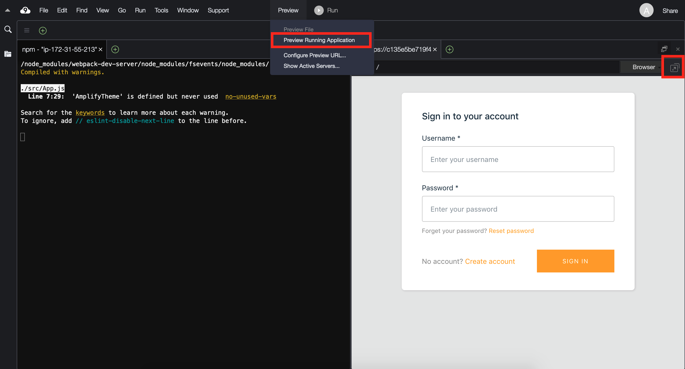
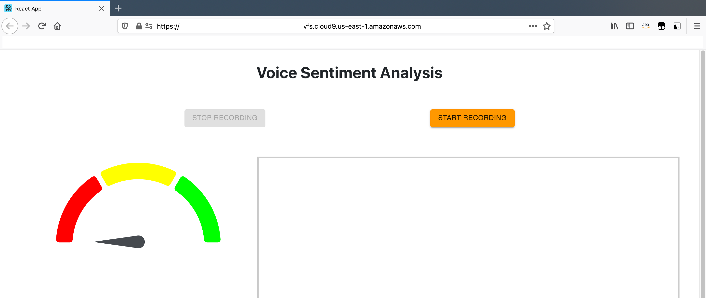
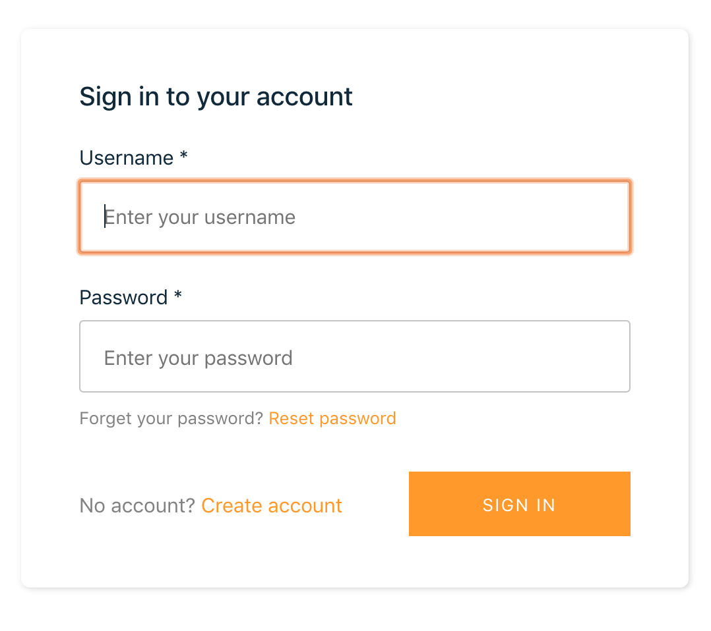
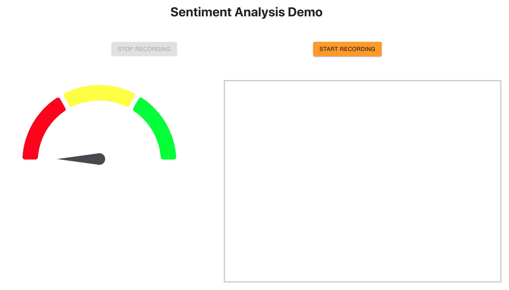

This lab is provided as part of [AWS Summit Online](https://aws.amazon.com/events/summits/online/), click [here](https://bit.ly/2yLtZqL) to explore the full list of hands-on labs.

ℹ️ You will run this lab in your own AWS account in **us-east-1** region. Please follow directions at the end of the lab to remove resources to minimize costs.
  
  
  # Dev Labs: Build a Sentiment Analysis App in minutes using Amplify Framework

In this workshop we will demonstrate how to add the AI and ML cloud service feature to your web application with [React](https://reactjs.org/) and the [Amplify Framework](https://aws-amplify.github.io/). We will learn to integrate following 3 AWS Services in your web application in few minutes

1. **Amazon Cognito**- Fully managed User Management
2. **Amazon Transcribe** - Adds speech-to-text capability
3. **Amazon Comprehend** -  Uses ML to find insights and relationships in text.

The above mentioned are a subset of services that can be added using AWS Amplify. Apart from these, You can provision, attach and use AWS AppSync(GraphQL API), API Gateway (REST API), Amazon S3(Storage), AWS Lambda (Functions), Amazon Pinpoint (Analytics), Amazon Lex (Interactions/Chatbots) etc to your application using AWS Amplify.

# Setting Up the Lab Environment

To run this lab, you will require an AWS account. You will be using a Cloud9, which is a web-based development environment that provides a terminal program running on a virtual machine that has the AWS CLI pre-installed and configured.

1. Login to your AWS Account.

2. From the Services menu, select Cloud9.

	If you are prompted for a region, select the one closest to you.

	You will now create a Cloud9 environment.

3. Click Create environment.

4. For Name, enter: amplify-sentimentAnalysis-lab

5. Click Next step twice, then click Create environment.

	Cloud9 will take a few minutes to launch the environment. Once it is ready, continue to the next step.

6. In the bash terminal at the bottom of the screen (showing ~/environment $), run the following commands:

	```
	region=$(curl -s http://169.254.169.254/latest/meta-data/placement/availability-zone | sed 's/\(.*\)[a-z]/\1/')
	
	cat <<END > ~/.aws/config
	[default]
	region=$region
	END
	
	git clone https://github.com/rahulbaisla/sentimentAnalysisLab.git
	
	```


7. Switch to projects root directory
	
	```
	cd sentimentAnalysisLab
	
	npm install
	```

8. You will now install the AWS Amplify CLI.

	`
	npm install -g @aws-amplify/cli
	`


## Initialize Amplify


Inside root directory of project run following command and provide the provided values to  set up Amplify project.

`
amplify init
`

`Enter a name for the project:` **sentimentAnalysisLab**

`Enter a name for the environment:` **dev**

`Choose your default editor:` **Visual Studio Code**

`Choose the type of app that you're building:` **javascript**
 
`What javascript framework are you using:` **react**

`Source Directory Path:`  **src**

`Distribution Directory Path:` **build**

`Build Command:`  **npm run-script build**

`Start Command:` **npm run-script start**

`Do you want to use an AWS profile?` **Yes**

`Please choose the profile you want to use` **default**


The AWS Amplify CLI will initialize a new project inside your React project & you will see a new folder: `amplify`. The files in this folder hold your project configuration.

## Add Authentication to the Web Application

Amplify CLI provisions [Amazon Cognito](https://aws.amazon.com/cognito/) as backend to provide authN/authZ support for your application. Below command and selected options will create a cloudformation template to provision the Amazon Cognito resource locally under PROJECT_ROOT_DIR/amplify/auth/NAME_OF_COGNITO_RESOURCE folder

`amplify add auth`

`Do you want to use the default authentication and security configuration?` **Default configuration**

`Warning: you will not be able to edit these selections. 
How do you want users to be able to sign in?` **Username**

`Do you want to configure advanced settings?` **No, I am done.**

## Add functionality to Transcribe text from audio

Amplify CLI provisions [Amazon Transcribe](https://aws.amazon.com/transcribe/) as backend to add speech-to-text functionality to your application. Below command and options will create a cloudformation template to provision the the Amazon Transcribe resource locally in your project under PROJECT_ROOT_DIR/amplify/predictions/NAME_OF_CONVERT_RESOURCE folder.

`amplify add Predictions`

`Please select from one of the categories below:` **Convert**

`What would you like to convert?` **Transcribe text from audio**

`Provide a friendly name for your resource:` **transcription**

`What is the source language?`  **US English**

`Who should have access?`  **Auth users only**


## Add functionality to Interpret the text

Amplify CLI provisions [Amazon Comprehend](https://aws.amazon.com/comprehend/) a natural language processing (NLP) service as backend to provide ability to interpret text and perform sentiment analysis. No machine learning experience is required for this feature. Below command and options will create a cloudformation template to provision the Amazon Comprehend resource locally in your project under PROJECT_ROOT_DIR/amplify/predictions/NAME_OF_INTERPRET_RESOURCE folder.

`amplify add Predictions`

`Please select from one of the categories below:` **Interpret**

`What would you like to interpret Interpret:` **Text**

`Provide a friendly name for your resource:` **interpret**

`What kind of interpretation would you like?` **All**

`Who should have access? ` **Auth users only**


## Push the Backend to AWS Cloud

amplify push
```
✔ Successfully pulled backend environment dev from the cloud.

Current Environment: dev

| Category    | Resource name                | Operation | Provider plugin   |
| ----------- | ---------------------------- | --------- | ----------------- |
| Auth        | sentimentanalysislab         | Create    | awscloudformation |
| Predictions | transcription                | Create    | awscloudformation |
| Predictions | interpret                    | Create    | awscloudformation |

Are you sure you want to continue? Yes
```

**Note:** Amplify CLI uses AWS CloudFormation as default provider to manage the backend attached to the application. Sometimes it can take additional time to create the AWS resources. In order to confirm the status of the Cloud Formation stack  and resources being created, login to AWS Console -> CloudFormation and locate the stack being deployed for your app. 

## Test the Application

1. In your project directory run following command
```
	npm run start
```

You should see something like this:

```
	You can now view sentimentAnalysisLab in the browser.
	
	Local:            http://localhost:8080/
	On Your Network:  http://172.31.40.28:8080/
```

2. In the Cloud9 **Preview** menu, click **Preview Running Application**.

3. Click the 'popout' icon to open it in a new browser tab, as shown below:
   

4.  Application launched in new tab in browser
   

5.  Create an user account
   

6. Sign-in to the Application

    

7. Start Recording and speak some text. Once finished stop the recording. 
   
   

The audio will be converted into text using Amazon Transcribe Service and the converted text will be interpreted to perform sentiment analysis using Amazon Comprehend Service.


## Understanding the code

Importing Amplify into your Front-end application.

**How it Works:** Amplify supports configuration of your connected AWS resources through a centralized file called aws-exports.js which defines all the regions and service endpoints to communicate. Whenever you run amplify push, this file is automatically created allowing you to focus on your application code. The Amplify CLI will place this file in the appropriate source directory configured with amplify init.

```
import Amplify, { Predictions } from 'aws-amplify';
import { AmazonAIPredictionsProvider } from '@aws-amplify/predictions';
import { withAuthenticator } from "@aws-amplify/ui-react";
import awsconfig from './aws-exports'; //aws-exports
```


It’s recommended to add the Amplify configuration step to your app’s root entry point. In case of React it would be App.js.

```
Amplify.configure(awsconfig);

Amplify.addPluggable(new AmazonAIPredictionsProvider());
```

Alternatively, You can also manually specify your existing Amazon AI and ML resources in your app using [Manual Setup](https://aws-amplify.github.io/docs/js/predictions#manual-setup)

Convert recorder audio to text Predictions.convert
```
function convertFromBuffer(bytes) {
    setResponse('Performing Sentiment Analysis...');

    Predictions.convert({
        transcription: {
          source: {
            bytes
          },
           language: "en-US", // other options are "en-GB", "fr-FR", "fr-CA", "es-US"
        },
      }).then(({ transcription: { fullText } }) => {interpretFromPredictions(JSON.stringify(fullText, null, 2))})
        .catch(err => console.log(JSON.stringify(err, null, 2)))   
  }
```

Performing sentiment analysis on text using Predictions.interpret
```
  function interpretFromPredictions(textToInterpret) {
    console.log("inside interpretFromPredictions")
    Predictions.interpret({
      text: {
        source: {
          text: textToInterpret,
        },
        type: "ALL"
      }
    }).then(result => {setResponse(JSON.stringify(result, null, 2));setGauge(result);})
      .catch(err => setResponse(JSON.stringify(err, null, 2)))
  }
```

## Host your web application using the AWS Amplify Console

    AWS also provides a CI/CD solution named [Amplify Console](https://aws.amazon.com/amplify/console/getting-started/) for single page web applications that follows a git-based workflow to deploy and host fullstack serverless web applications which can include frontend and backend both. Using Amplify Console to host your app can accelerate the release cycle of your product by providing a simple workflow for deploying full-stack serverless applications. Here are few [Fullstack serverless example projects](https://aws.amazon.com/amplify/console/getting-started/) to start with.


## Recap

In a few minutes you were able to create a Sentiment Analysis application from scratch with:

A scalable serverless back-end:

    Amazon Cognito - Fully managed authN/authZ service 
    Amazon Transcribe - Functionality to convert speech-to-text
    Amazon Comprehend - Natural language processing (NLP) service that uses machine learning to find insights and relationships in text.

A browser-based React front-end:

    Use case-centric open source libraries that require minimal code to use for invoking the APIs and connect to backend resources.

Overall, Developers can focus on the business logic and use AWS Amplify to provision and manage the backend services for your app.

## Clean Up

Please follow these instructions to clean-up your account so that there will be no on-going charges for any services used.

Run this command to remove resources that were created during the lab (Press Ctrl+C first to stop the running app):

	amplify delete

Return to the Cloud9 console by clicking AWS Cloud9 in the top left, then click Go To Your Dashboard.

Delete the amplify-sentimentAnalysis-lab.

	You will need to enter Delete to delete the environment.

## Further reading on AWS Amplify

    AWS Amplify framework: https://aws-amplify.github.io/
    AWS Amplify product page: https://aws.amazon.com/amplify/
    AWS Amplify GitHub: https://github.com/aws-amplify
    AWS Amplify Community: https://amplify.aws/community/posts
    AWS Amplify Lobby: https://gitter.im/AWS-Amplify/Lobby
